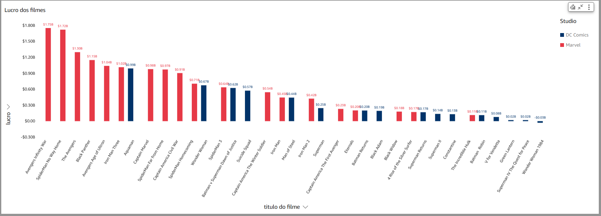

# Entrega 5
Após a criação da conta no Quicksight, importei os dados utilizando as tabelas da camada Refied do Data Lake, fazendo ligação com o Athena. 

Por fim, as analises definidas para criação do dashboard foi, fazer uma comparação entre os filmes da Marvel e da DC comics, observando os seguintes aspectos: 

- Quais são os filmes mais lucrativos de cada estúdio?
- Existe uma relação entre o orçamento e a receita? Filmes com maiores orçamentos tendem a ser mais lucrativos?
- O número de votos está correlacionado com a nota média? Filmes mais populares recebem melhores avaliações?
- Filmes com maiores receitas tendem a ter notas médias mais altas ou mais baixas?

A comparação entre esses dois universos é relevante porque eles são os principais concorrentes no gênero de super-heróis e enfrentam desafios semelhantes em atender às expectativas de audiência, equilibrar custos e receitas e manter um alto nível de engajamento público.

Perguntas e Análises

1. Com os dados disponíveis, foram analisados 19 filmes da Marvel e 16 da DC Comics. Ao observar o lucro, a Marvel apresenta resultados superiores em termos de bilheteria. Cinco filmes ultrapassam a marca de 1 bilhão de dolares, enquanto o maior sucesso da DC, "Aquaman", atinge $992 milhões.

2. Existe uma relação entre o orçamento e a receita? Filmes com maiores orçamentos tendem a ser mais lucrativos?

Na DC Comics, a relação entre orçamento e receita é menos consistente. Filmes com altos orçamentos, como "Batman v Superman", apresentam bons retornos, mas outros, como "Justice League", não alcançam o mesmo sucesso.

Na Marvel Studios, há uma correlação mais clara. Filmes como "Avengers: Endgame", que tiveram altos investimentos, também lideram as bilheterias. Isso indica um planejamento financeiro mais eficaz.

3. O número de votos está correlacionado com a nota média? Filmes mais populares recebem melhores avaliações?

Na Marvel, existe uma tendência moderada de correlação: filmes com muitos votos, como "Avengers: Endgame" e "Avengers: Infinity War", recebem também altas notas médias (8.4 e 8.3, respectivamente).

Na DC, a relação é menos evidente. Filmes como "Wonder Woman" apresentam boas notas e muitos votos, mas outros, como "Suicide Squad", mostram que um grande número de votos nem sempre está associado a boas avaliações.

4. Filmes com maiores receitas tendem a ter notas médias mais altas ou mais baixas?

Na Marvel, há uma forte relação positiva. Filmes com altas receitas geralmente recebem boas avaliações, como "Avengers: Endgame" (nota 8.4) e "Black Panther" (nota 8.3).

Na DC, a relação é mais variada. Enquanto "Wonder Woman" combina uma boa nota média (7.4) com alta receita, filmes como "Batman v Superman" mostram um desempenho financeiro alto, mas notas médias mais baixas (6.4).

## Conclusão 

Comparar os desempenhos da DC Comics e Marvel Studios permite entender como diferentes estratégias cinematográficas e de marketing impactam o sucesso financeiro e a recepção do público. Ambas as marcas enfrentam desafios semelhantes, mas suas abordagens distintas oferecem insights sobre:

- A importância de universos conectados para aumentar o engajamento.

- O impacto do planejamento orçamentário nas receitas.

- Como atender às expectativas do público afeta as notas e o número de votos.

A Marvel Studios parece ter mais acertos ao equilibrar o quanto gasta, a história que conta e como divulga, o que normalmente resulta em bons retornos e engajamento. A DC Comics também tem seus momentos de brilho com filmes como "Mulher-Maravilha" e "Aquaman", mas ainda sofre para manter esse ritmo de forma constante. No fim, fica claro que ter uma estratégia bem amarrada faz diferença no resultado e na recepção do público.

A Marvel, parece que eles sabem onde colocar o dinheiro sem exagerar. A DC, por outro lado, às vezes investe pesado, mas nem sempre isso se traduz em boas avaliações. Dá aquela impressão de que não é só o orçamento que conta, mas também a forma como o filme ressoa com o público.

Mesmo que investir mais aumente as chances de sucesso, outros fatores, como a conexão emocional e a criatividade, acabam sendo essenciais.