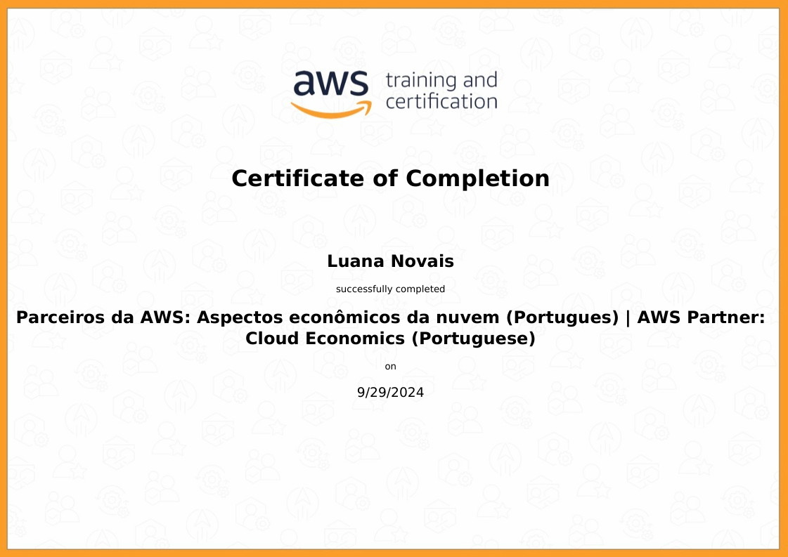

# Sprint 3

# Python

 Durante a Sprint 3, aprofundei meus conhecimentos em Python, uma das linguagens de programação mais populares e amplamente utilizadas em projetos de dados. Abaixo, destaco os principais pontos que aprendi: 

##### Sintaxe Básica do Python
- Declaração de Variáveis: Aprendi a declarar variáveis e utilizar a tipagem dinâmica de Python, que permite maior flexibilidade ao trabalhar com diferentes tipos de dados.
- Estruturas de Controle: Entendi como utilizar estruturas de controle, como if, for e while, para criar fluxos de controle eficientes no meu código. Essas estruturas são essenciais para a criação de programas que tomam decisões e repetem operações de forma automática.
- Funções: Entendi como definir funções usando a palavra-chave **def**, passar parâmetros, retornar valores e a importância de organizar o código em funções para torná-lo mais modular e fácil de manter. Compreendi também a importância das funções de ordem superior na programação funcional.

##### Python para Processamento de Dados
- Manipulação de Arquivos: Aprendi como Python facilita a leitura e escrita de arquivos, habilidades essenciais para o processamento e análise de grandes volumes de dados. O curso me ensinou a manipular arquivos em Python, como abrir, ler, escrever e fechar arquivos. Aprendi a trabalhar com diferentes modos de abertura de arquivos, como **leitura (r)** e  **escrita (w)**. Além disso, explorei como usar o **bloco with** para garantir que os arquivos sejam corretamente fechados após sua manipulação.
- Estruturas de Dados: Compreendi como utilizar listas, dicionários e outras estruturas de dados embutidas em Python para organizar e manipular dados de forma eficiente.
- Introdução a Bibliotecas: Fui introduzido às bibliotecas Pandas e NumPy, que são fundamentais para o processamento de dados em Python. Aprendi sobre outras bibliotecas importantes, como Matplotlib e Seaborn, para visualização de dados, o que me ajudou a apresentar resultados de forma mais clara e informativa.

# AWS Partner - Economias na nuvem AWS

 O objetivo é fornecer dados valiosos que possam ser compartilhados com nossos clientes, demonstrando de forma quantificável o valor comercial da migração de uma infraestrutura on-premises para a AWS. Esses dados são essenciais para ajudar a desenhar um caso de negócio, destacando os potenciais ganhos do uso da nuvem. 

 O curso começou com uma introdução sobre os aspectos econômicos e o valor comercial da nuvem. Em seguida, analisamos os pilares do AWS Cloud Value Framework, uma metodologia criada pela AWS que quantifica e qualifica os benefícios da nuvem, como redução de custos, aumento da produtividade da equipe, resiliência operacional, agilidade empresarial e sustentabilidade. Também abordamos a gestão financeira na nuvem e as ferramentas que a AWS oferece para criar estudos de caso que comparam a infraestrutura local à nuvem. 

 Os aspectos econômicos da nuvem concentram-se no valor comercial e no gerenciamento financeiro da infraestrutura na nuvem, enfatizando a importância de envolver todos os stakeholders, como TI e finanças, nas discussões iniciais sobre migração. Em vez de focar apenas em preços, é fundamental avaliar a eficiência dos processos, evitando simplesmente migrar ineficiências de ambientes on-premises para a nuvem. Com a adoção da AWS, as empresas podem se libertar das tarefas táticas dos data centers tradicionais, reduzindo custos e acelerando a inovação ao utilizar serviços e tecnologias mais avançadas. 

 A AWS oferece ferramentas como o AWS Identity Access Management (IAM) para gerenciar segurança e conformidade, e promove uma "falha rápida", permitindo encerrar iniciativas sem desperdício de recursos. A infraestrutura da AWS também contribui para a sustentabilidade, reduzindo a pegada de carbono através do uso de energia renovável. Além disso, operações financeiras na nuvem são aprimoradas por meio de identificação e investimento em processos e automação, assegurando que os clientes maximizem os benefícios de custo de suas cargas de trabalho. Ferramentas como a Avaliação do Portfólio de Migração (MPA) e o AWS Cost Explorer são essenciais para a análise e planejamento eficaz da migração.

# Exercícios
Ao longo da Sprint 3, foi proposto 25 exercicios para treinar a lingaugem Python. A resolução dos exercicios pode ser observados na pasta [Exercicios](./exercicios)

##### Exercicio - ETL com Python 

Nesse exercicío foi aplicado conhecimentos de ETL utilizando Python sem o uso de bibliotecas externas. O objetivo foi extrair, transformar e carregar dados de forma manual, o que me permitiu entender melhor cada etapa do processo e como manipular dados utilizando apenas as funcionalidades básicas da linguagem.
Foi disponibilizado um arquivo .csv com as colunas Actor, Tital Gross, Number of movies, Average per Movie, Movie, Gross. Os passos de como resolvi o desafio pode ser observado no Script 
[Resolução ETL](./exercicios/seção-5/exercicio-ETL.py)

- Etapa 01: Ator/atriz com maior número de filmes [Resultado](./exercicios/seção-5/etapa-1.txt)
- Etapa 02: Média de receita de bilheteria dos principais filmes [Resultado](./exercicios/seção-5/etapa-2.txt)
- Etapa 03: Ator/atriz com a maior média de receita bruta por filme [Resultado](./exercicios/seção-5/etapa-3.txt)
- Etapa 04: Contagem de aparições dos filmes no dataset [Resultado](./exercicios/seção-5/etapa-4.txt)
- Etapa 05: Lista dos atores ordenada pela receita bruta de bilheteria [Resultado](./exercicios/seção-5/etapa-5.txt)

# Certificados

# Desafio

 O intuito do desafio era praticar os conhecimentos adquiridos em Python, foi disponibilizado uma base de dados e o objetivo foi ler esse arquivo de estatistica da Loja do Google Play Store, processar esses dados e gerar gráficos de análise. 

[Desafio](./desafio/README.md)
