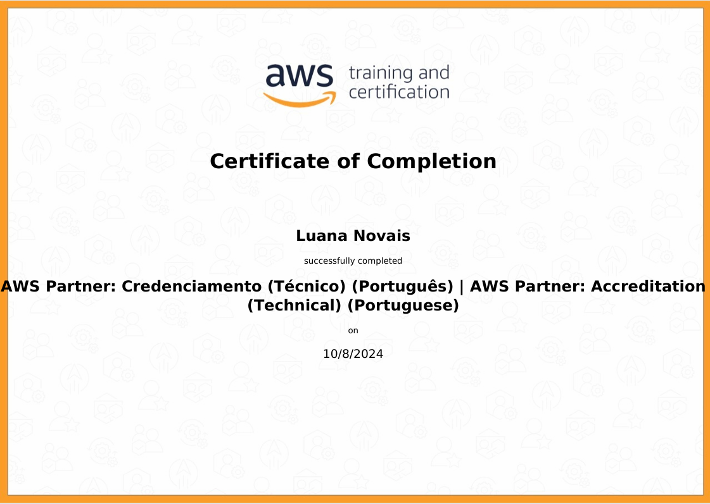

# Sprint 4 
Nesta Sprint você aprendi sobre alguns conceitos de programação funcional, além de conhecer sobre os containers com Docker e Kubertentes. 

# Programação Funcional em Python
Programação funcional é uma abordagem para desenvolver software baseada na composição de funções puras, evitando o uso de estados compartilhados, dados mutáveis e efeitos colaterais. Ao invés de ser imperativa, ela adota um estilo declarativo, focando no o que deve ser feito, em vez de como fazê-lo.
Programação Funcional em Python, um paradigma que trata o processamento através de funções matemáticas, evitando o uso de estados mutáveis e efeitos colaterais. Aqui estão alguns dos princípios-chave utilizados:

- Funções de Ordem Superior: Funções que podem receber outras funções como argumento ou retorná-las como resultado, tornando o código mais modular e reutilizável.
- Funções Lambda: Utilizadas para criar funções anônimas de forma concisa.
- Imutabilidade: ma vez que um valor ou estrutura de dados é criado, ele não pode ser alterado. Isso significa que, em vez de modificar diretamente os dados existentes, novas cópias dos dados são criadas com as mudanças desejadas.
- MAP(func, iterável): Aplica uma função a todos os itens de um iterável (como listas ou tuplas).
- FILTER(func, iterável): Filtra os elementos de um iterável com base em uma função que retorna True ou False
- REDUCE(func, iterável): Reduz um iterável a um único valor com base em uma função acumuladora.
- Generators: maneira eficiente de iterar sobre grandes conjuntos de dados ou realizar operações preguiçosas (lazy evaluation), sem a necessidade de armazenar todos os itens na memória de uma vez. Eles são funções que utilizam a palavra-chave ``yield`` em vez de ``return``, permitindo que o estado da função seja "pausado" e retomado de onde parou quando necessário.

# AWS Partner: Accreditation (Technical) 
Durante o curso adquiri uma compreensão sólida dos serviços fundamentais da AWS, como EC2, S3 e RDS, além de frameworks essenciais como o AWS Cloud Adoption Framework (CAF) e o AWS Well-Architected Framework. Aprendi como aplicar estratégias de migração eficientes e seguras para a nuvem, garantindo a otimização de desempenho, segurança e custos das soluções. Compreendi a importância de alinhar as soluções de nuvem às melhores práticas arquiteturais da AWS, e como utilizar esses conhecimentos para apoiar empresas na transição e gestão de suas cargas de trabalho na AWS.
- EC2 (Elastic Compute Cloud): Serviço de computação na nuvem que fornece capacidade escalável de processamento, permitindo a criação e gerenciamento de instâncias virtuais, oferecendo flexibilidade para executar aplicativos com eficiência.

- S3 (Simple Storage Service): Serviço de armazenamento de objetos altamente escalável e seguro, utilizado para armazenar e recuperar grandes volumes de dados, como arquivos, backups e mídia, com alta durabilidade e disponibilidade.

- RDS (Relational Database Service): Serviço gerenciado de banco de dados relacional que suporta vários mecanismos de banco de dados, como MySQL, PostgreSQL e Oracle, permitindo a fácil configuração, operação e escalabilidade de bancos de dados na nuvem.

- CAF (Cloud Adoption Framework): Um conjunto de diretrizes da AWS que ajuda as organizações a adotarem a nuvem de forma sistemática, dividindo o processo de migração em seis áreas (pilares) como governança, operações e segurança.

- AWS Well-Architected Framework: Conjunto de boas práticas e princípios para projetar e operar arquiteturas seguras, resilientes, eficientes e de alto desempenho na nuvem, organizado em cinco pilares: excelência operacional, segurança, confiabilidade, eficiência de desempenho e otimização de custos.

# Docker

O Docker é uma plataforma que simplifica o setup e a execução de aplicações, permitindo a criação de contêineres, que são ambientes isolados para rodar essas aplicações. Esses contêineres funcionam como sistemas independentes, capazes de rodar em qualquer sistema operacional que suporte Docker, seja no seu laptop, servidor ou na nuvem. Com Docker, as aplicações em contêiner podem ser executadas em qualquer ambiente compatível, garantindo consistência entre desenvolvimento e produção.
Cada contêiner roda isolado, sem interferir em outros processos ou aplicativos, o que garante maior estabilidade e controle. Além disso, o Docker é mais leve e utiliza menos recursos do que máquinas virtuais tradicionais, tornando-o uma solução eficiente para gestão de ambientes. Ele também ajuda a evitar a chamada "Matrix from Hell", um cenário onde múltiplas configurações de ambiente tornam o desenvolvimento e a implantação de aplicações mais complicados.

##### Contêiner
Um contêiner no Docker é uma instância em execução de uma imagem. Ele encapsula uma aplicação e todas as suas dependências em um ambiente isolado, garantindo que o software funcione de forma consistente em qualquer lugar. Contêineres compartilham o kernel do sistema operacional, mas mantêm seus processos, bibliotecas e arquivos de sistema isolados, o que os torna leves e eficientes. Diferente de máquinas virtuais, contêineres não precisam de um sistema operacional completo, o que reduz o uso de recursos.
Os comandos básicos são:

``docker ps`` - listar contêineres em execução

``docker ps -a`` - listar todos so contêineres, inclusive os parados

``docker run``- criar e iniciar um novo contêiner

``docker stop`` - para um contêiner em execução

``docker start`` - iniciar um contêiner parado

``docker rm`` - remover um contêiner 

##### Imagem
Uma imagem no Docker é um modelo imutável que contém tudo o que é necessário para rodar uma aplicação, incluindo o código-fonte, bibliotecas, variáveis de ambiente, e configurações de sistema. As imagens são construídas a partir de um arquivo chamado Dockerfile, que especifica uma sequência de comandos para montar a imagem. As imagens são lidas e podem ser compartilhadas e reutilizadas em qualquer ambiente onde o Docker esteja instalado. Quando uma imagem é executada, ela se transforma em um contêiner.
Os comandos básicos são:

``docker images`` - Listar imagens disponíveis no sistema

``docker build -t`` - Criar uma imagem a partir de um Dockerfile

``docker rmi`` - remover uma imagem

# Exercícios
Para treinar a programação funcional em Python foi pedido para realizar a resolução de 7 exercícios, a resolução dos exercicios pode ser observados na pasta [Exercicios](./exercicios)

# Certificados

# Desafio

O desafio dessa Sprint era praticar a linguagem Python com Containers Docker. Foi disponibilizado um arquivo ``carguru.py`` que foi utilizado como entrada no processo, era solicitado a criação de uma imagem que executasse o código do ``carguru.py``

[Desafio](./desafio/README.md)
