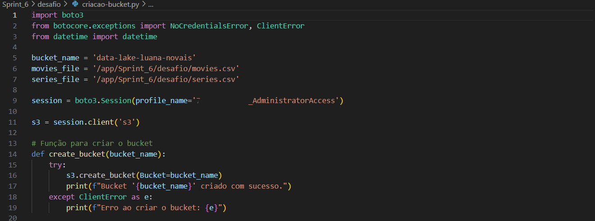
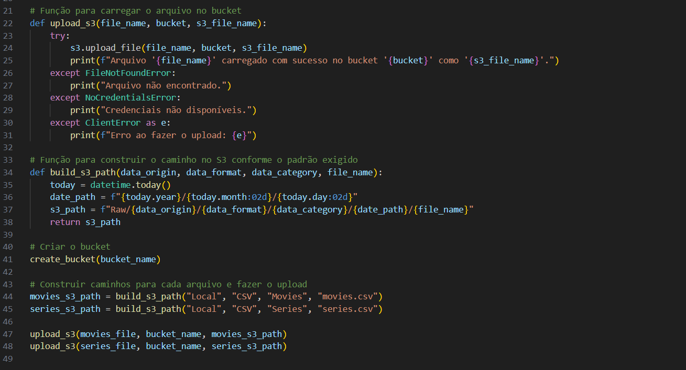
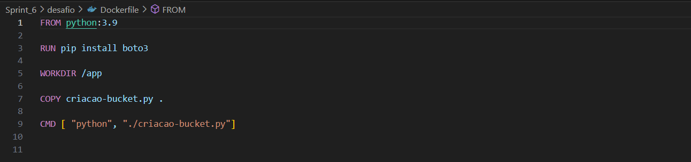
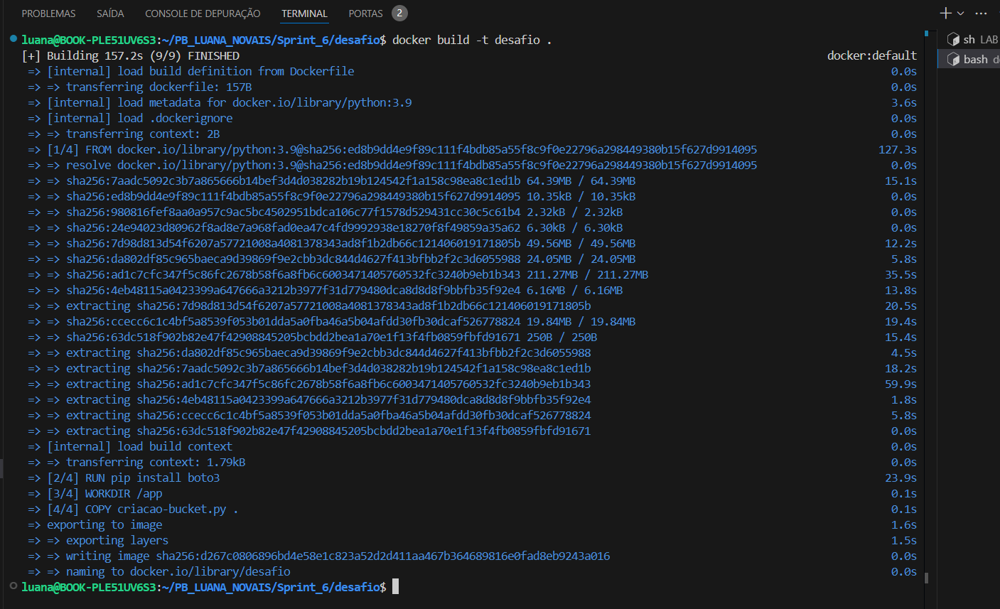
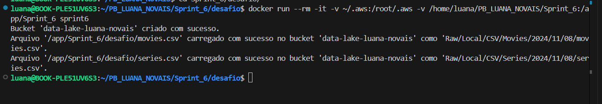
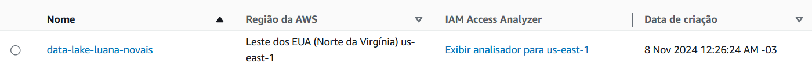
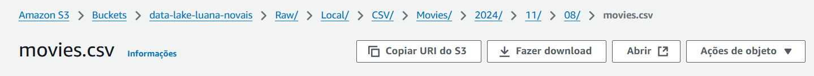
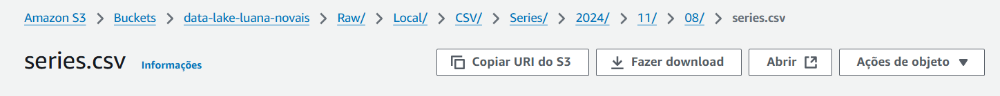

# Análise
Para resolver o desafio final, minha Squad ficou responsável pelo gênero de Sci-fi/Fantasia. Eu escolhi focar no Sci-Fi e pretendo explorar as seguintes questões:

- Quais são os atores que mais aparecem em filmes de sci-fi e como são avaliados?
Com isso, quero identificar quais artistas estão mais associados ao gênero e ver se sua presença impacta positivamente as avaliações. Essa análise pode trazer insights sobre estrelas específicas do sci-fi.

- Qual a relação entre o número de votos e a nota média?
Filmes com mais votos tendem a ter notas mais altas ou mais baixas? Essa questão ajuda a entender a relação entre popularidade e qualidade percebida, mostrando se filmes mais comentados também são mais apreciados ou se filmes populares tendem a dividir opiniões.

- Quantos lançamentos de filmes de sci-fi ocorrem por década?
Olhar para a quantidade de lançamentos ao longo do tempo pode revelar se o gênero está em alta, em baixa ou estável, além de mostrar como ele responde a mudanças culturais e tecnológicas.

- Filmes de sci-fi que combinam outros gêneros (como ação, aventura, comédia) têm orçamentos mais altos?
Comparar orçamentos entre sci-fi puro e sci-fi misturado com outros gêneros ajuda a entender onde estão os maiores investimentos. Isso pode indicar uma expectativa de retorno maior ou a necessidade de mais efeitos especiais.

- Como os custos de produção de filmes de sci-fi evoluíram ao longo das décadas?
Essa análise traz uma visão da escalada de custos em produções de sci-fi, ajudando a entender o impacto da tecnologia e das expectativas de produção nos orçamentos.

# Entrega 1

O objetivo deste desafio foi realizar a ingestão de arquivos CSV de filmes e séries no Amazon S3 utilizando a biblioteca `boto3` e executando o processo dentro de um container Docker. A proposta era desenvolver um sistema que carregasse os dados locais para a nuvem via um processo batch e organizasse os arquivos no bucket seguindo uma estrutura de diretórios específica.

Todas as evidencias podem ser observadas na pasta [evidencias](../evidencias/)

### 1. Implementação do Código em Python
O primeiro passo foi desenvolver um código em Python que:
- Lê os arquivos CSV de filmes e séries sem realizar filtragem de dados.
- Conecta-se ao Amazon S3 usando a biblioteca `boto3`.
- Faz o upload dos arquivos para um bucket no S3, seguindo o padrão de diretório: ``<nome_do_bucket>/Raw/Local/CSV/<tipo_de_dado>/<ano>/<mês>/<dia>/<arquivo.csv>``

O script em Python ficou da seguinte forma: 

### 2. Configuração do Docker

Para executar o processo em um ambiente isolado, foi criado um container Docker com o seguinte Dockerfile:

O Dockerfile configura uma imagem baseada no Python 3.10, instala a biblioteca boto3, copia o script Python e define o comando para executar o script.

### 3.  Construção e Execução do Container Docker

Primeiro, construí a imagem Docker com o comando: ``docker build -t`` 

Em seguida, executei o container Docker, montando um volume com o diretório onde os arquivos CSV estão localizados. Isso permitiu que o script dentro do container acessasse os arquivos e fizesse o upload para o S3.

Nos prints podemos ver que foi criado com sucesso e abaixo podemos ver como ficou na aws. 

Neste desafio, foi implementada uma solução de ingestão batch de dados para o Amazon S3, utilizando boto3 e Docker. O processo foi executado com sucesso dentro de um container Docker, garantindo a portabilidade e a escalabilidade da aplicação para ambientes de produção. A estrutura de diretórios no S3 foi organizada conforme especificado, permitindo o controle e a organização dos arquivos carregados.