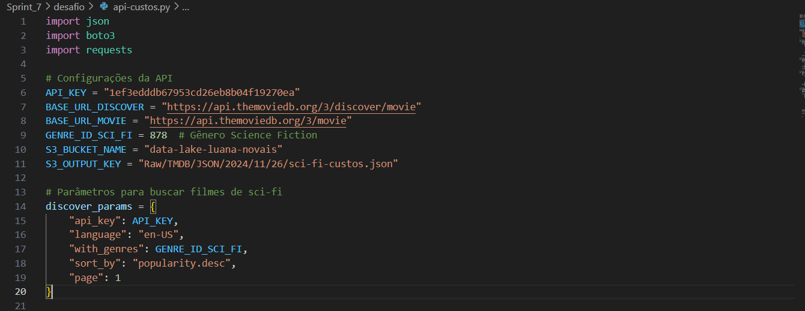
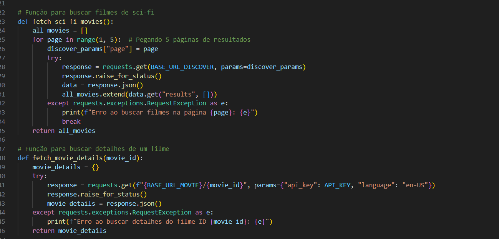
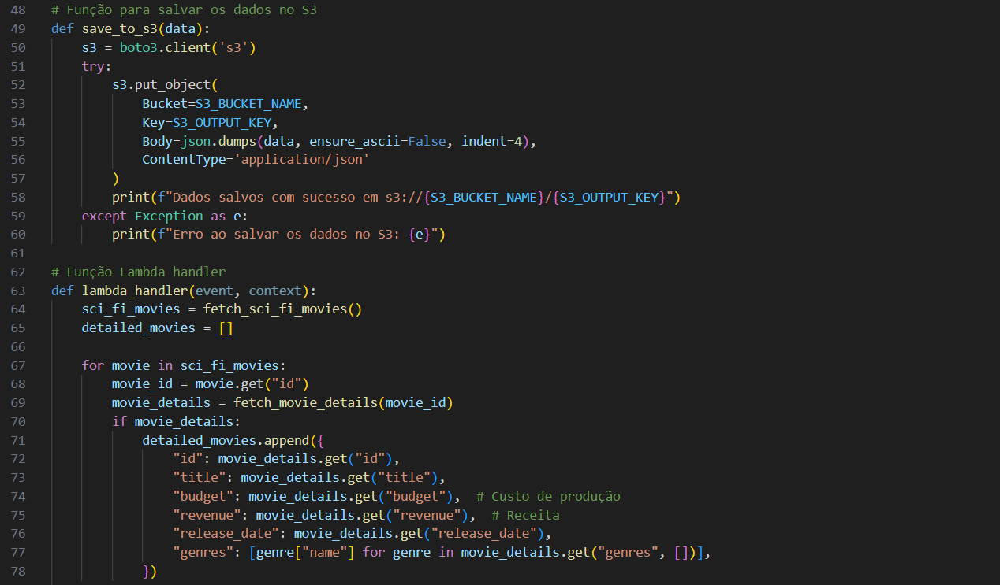
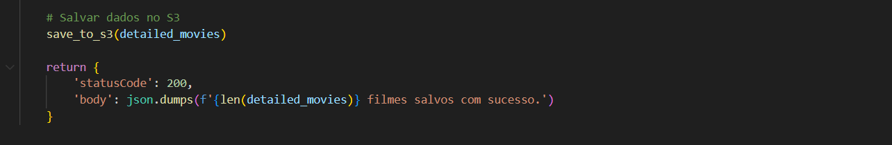
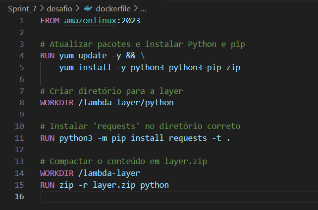
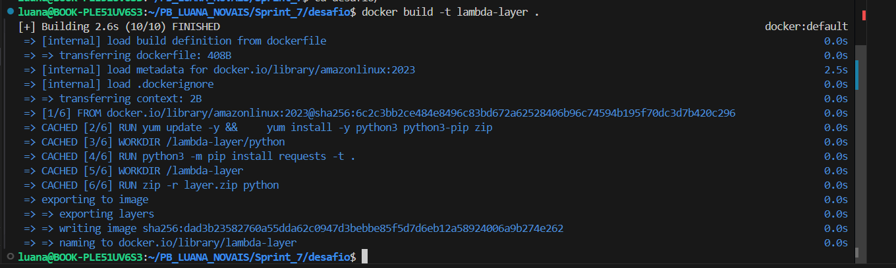
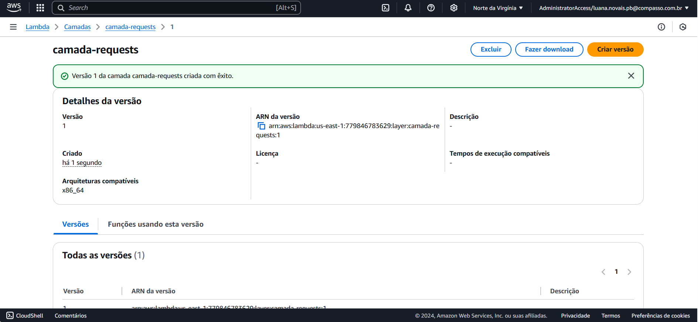
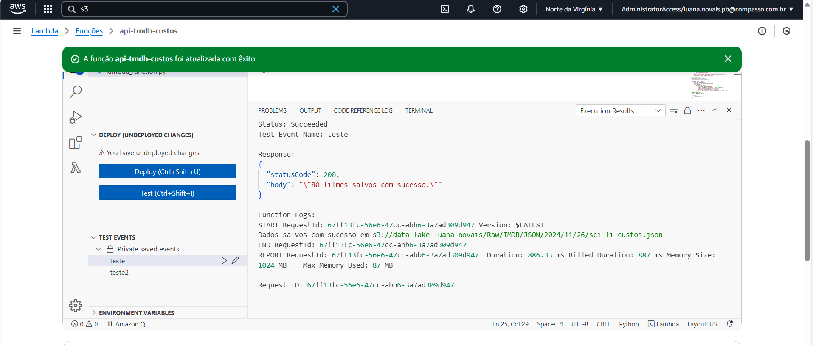
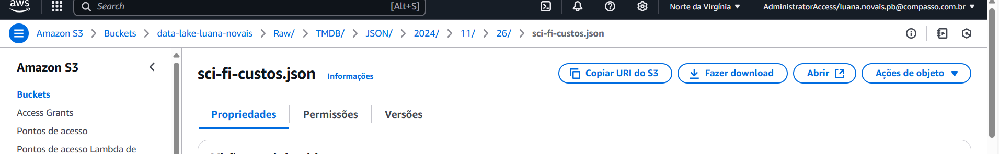

# Análise
Para resolver o desafio final, minha Squad ficou responsável pelo gênero de Sci-fi/Fantasia. Eu escolhi focar no Sci-Fi e pretendo explorar as seguintes questões:

- Quais são os atores que mais aparecem em filmes de sci-fi e como são avaliados?
Com isso, quero identificar quais artistas estão mais associados ao gênero e ver se sua presença impacta positivamente as avaliações. Essa análise pode trazer insights sobre estrelas específicas do sci-fi.

- Qual a relação entre o número de votos e a nota média?
Filmes com mais votos tendem a ter notas mais altas ou mais baixas? Essa questão ajuda a entender a relação entre popularidade e qualidade percebida, mostrando se filmes mais comentados também são mais apreciados ou se filmes populares tendem a dividir opiniões.

- Quantos lançamentos de filmes de sci-fi ocorrem por década?
Olhar para a quantidade de lançamentos ao longo do tempo pode revelar se o gênero está em alta, em baixa ou estável, além de mostrar como ele responde a mudanças culturais e tecnológicas.

- Filmes de sci-fi que combinam outros gêneros (como ação, aventura, comédia) têm orçamentos mais altos?
Comparar orçamentos entre sci-fi puro e sci-fi misturado com outros gêneros ajuda a entender onde estão os maiores investimentos. Isso pode indicar uma expectativa de retorno maior ou a necessidade de mais efeitos especiais.

- Como os custos de produção de filmes de sci-fi evoluíram ao longo das décadas?
Essa análise traz uma visão da escalada de custos em produções de sci-fi, ajudando a entender o impacto da tecnologia e das expectativas de produção nos orçamentos.

# Entrega 2 

Nessa Sprint, o objetivo era criar uma função Lambda que consumisse dados da API TMDB, processasse essas informações e fizesse o upload para um bucket do S3. Para responder minhas análises eu precisava buscar dados sobre custos de produção, pois o restante dos dados que precisava, já tinha presente no arquivo CSV. A principal API utilizada para a ingestão de dados foi a do TMDB (The Movie Database). Esta API foi escolhida para complementar os dados dos filmes e séries já carregados na Etapa 1 do desafio. O objetivo é capturar informações adicionais sobre os filmes de ficção científica, como custo de produção, receita, a partir da API do TMDB.

#### Script

 Primeiramente desenvolvi um script para que pudesse puxar esses dados da API TMDB. 

 A primeira parte do código configura os parâmetros necessários para fazer as requisições à API do TMDB, a chave da API (API_KEY) é usada para autenticar as requisições, e as URLs baseadas no TMDB permitem que busquemos filmes de ficção científica e detalhes dos filmes:

- ``fetch_sci_fi_movies()``: Responsável por buscar filmes de ficção científica usando a API do TMDB. Ela faz requisições para 5 páginas de resultados.
- ``fetch_movie_details()``: Faz a requisição para pegar detalhes de cada filme, como orçamento, receita, data de lançamento e gêneros.

Depois de coletar todos os dados necessários, o código salva os resultados no S3 usando a biblioteca boto3, Os dados são salvos em um formato JSON, organizado pelo nome do bucket, tipo de dado e data de processamento:

A função principal ``lambda_handler`` orquestra o processo de coleta e armazenamento dos dados.
Após a execução da função Lambda, os dados estão salvos em formato JSON no S3:

#### Criação da Camada Docker para Importação do Requests
Para garantir que a função Lambda tenha as dependências necessárias, como a biblioteca requests, foi criada uma camada utilizando Docker. Essa camada foi criada para encapsular a instalação das dependências necessárias de maneira eficiente.
- Criação do Dockerfile: Um Dockerfile foi criado para configurar o ambiente de execução e importar a biblioteca requests

- Construção da Imagem Docker: A imagem Docker foi construída utilizando o comando:

- Publicação da Camada: Após construir a imagem, a camada foi empacotada e carregada para o AWS Lambda para ser usada pela função.

#### Resultado
Com o código criado e a camada configurada, executei o código no lambda e podemos ver que foi executado com sucesso, puxando 80 filmes do TMDB.

Depois podemos ver que o arquivo foi salvo no bucket da forma que pedia no desafio. 

Este desafio envolveu a ingestão de dados de filmes de ficção científica a partir da API do TMDB e o armazenamento desses dados em um bucket S3. A criação de uma camada Docker para importar a biblioteca requests foi fundamental para garantir que as dependências fossem atendidas no ambiente Lambda, permitindo a execução correta do código. As questões de análise propostas podem ser respondidas utilizando os dados coletados, permitindo insights sobre a indústria de filmes de sci-fi. 