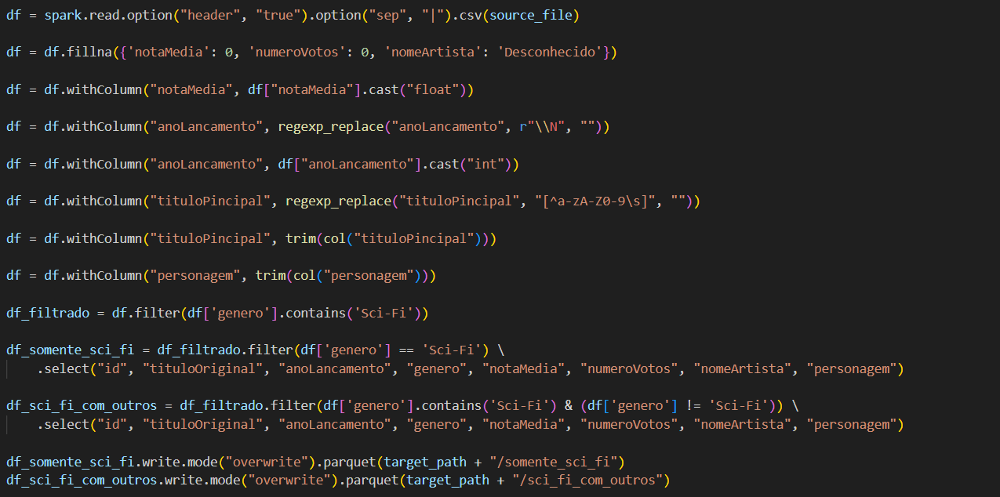
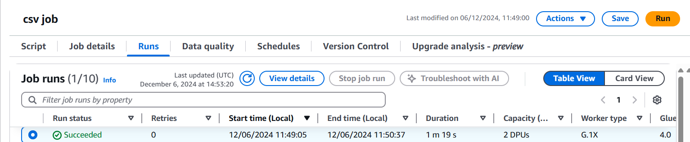
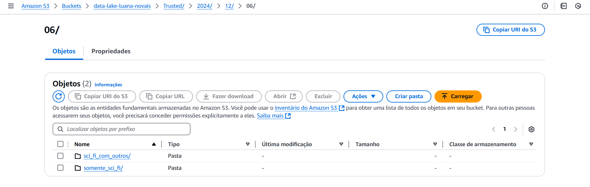
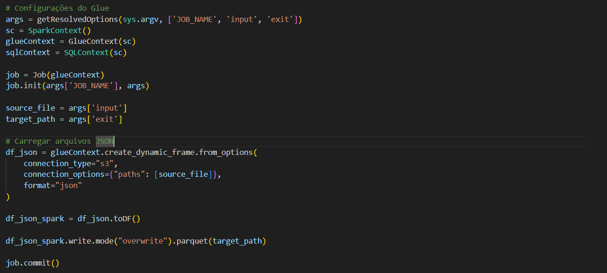
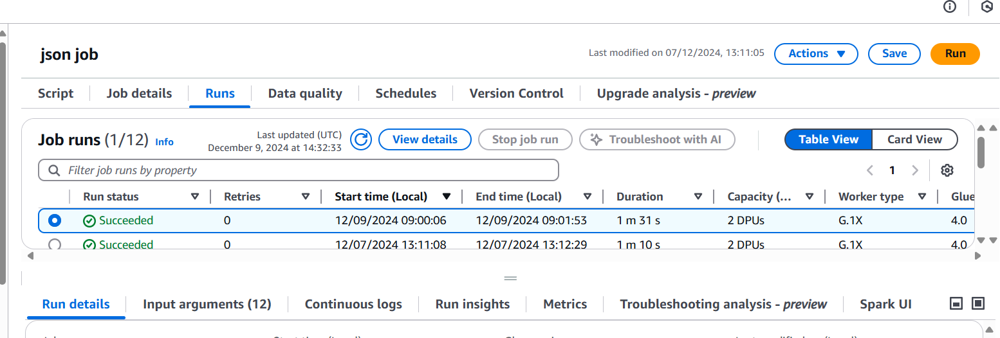
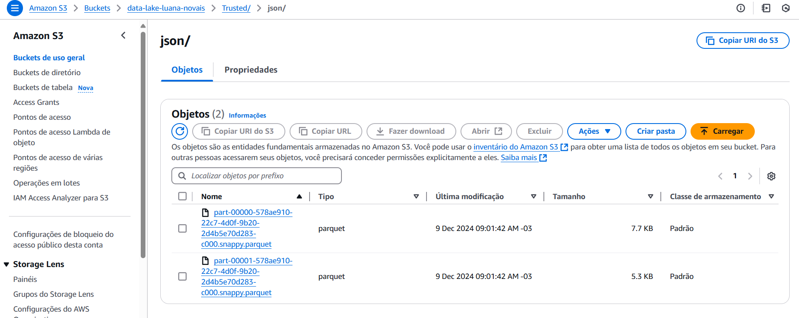

# Análises

Após revisar o CSV e os dados do TMDB, decidi ajustar minha análise para focar apenas nos filmes de ficção científica da Marvel e da DC. A comparação entre esses dois estúdios revela as diferenças e semelhanças entre duas das maiores franquias de super-heróis. A Marvel segue uma estratégia de universo interconectado com o MCU, enquanto a DC adota uma abordagem mais diversificada e sombria. Esse contraste nos permite avaliar como cada estúdio gerencia orçamentos, desempenho financeiro, e recepção do público.

1. Como o orçamento e a receita dos filmes de ficção científica da Marvel se comparam com os filmes da DC?
Justificativa: Comparar o retorno sobre o investimento (ROI) das duas franquias pode destacar qual estúdio consegue gerir melhor seu orçamento e gerar maior receita.

2. Como as notas médias e o número de votos se comparam entre os filmes de ficção científica da Marvel e da DC?
Justificativa: Filmes com altas notas e grande número de votos indicam uma melhor recepção crítica e maior engajamento do público. Comparar as duas franquias pode mostrar qual delas tem mais apelo entre os espectadores.

3. Quais personagens de ficção científica têm maior sucesso de bilheteira em cada franquia?
Justificativa: Personagens populares geralmente atraem mais público e geram maior receita. Analisar o desempenho financeiro de filmes centrados em certos heróis pode mostrar quais personagens têm mais sucesso.

4. Como o número de lançamentos de filmes de ficção científica da Marvel e da DC evoluiu ao longo dos anos?
Justificativa: A quantidade de lançamentos pode refletir a estratégia de crescimento de cada franquia, ajudando a entender qual estúdio tem mantido maior consistência e planejamento na produção de filmes.

###### Ajuste da API

Como mencionei a mudança na análise, voltei no script da Sprint 7 e fiz uma pequena alteração colocando o ID de cada estudio, para dessa forma puxar somento os filmes dos dois estudios.

# Entrega 3

O objetivo dessa etapa é implementar uma camada Trusted no data lake para consolidar e padronizar dados de diversas fontes, assegurando sua qualidade e confiabilidade para análise. A partir dos dados brutos armazenados na camada Raw, utilizei o AWS Glue para processar e transformar os dados em um formato padronizado (PARQUET).
A camada Trusted busca proporcionar uma visão integrada dos dados, pronta para ser explorada com comandos SQL, facilitando análises consistentes e confiáveis. O processamento foi organizado em dois jobs no AWS Glue:

- Processamento do CSV: Responsável por limpar e padronizar os dados batch, sem particionamento por data de criação.
- Processamento da API TMDB: Focado em transformar os dados ingeridos da API e persistir os resultados particionados na Trusted Zone.

#### Job csv

#### **1. Tratamento de Valores Nulos**
Resolvi fazer um tratamento das colunas caso tivessem dados nulos, para uma melhor confiabilidade dos dados:
- **`notaMedia`**: Substituído por `0` (zero), indicando que filmes sem notas terão a menor pontuação possível.
- **`numeroVotos`**: Substituído por `0` (zero), assumindo que filmes sem registros de votos não foram avaliados.
- **`nomeArtista`**: Substituído por `"Desconhecido"`, permitindo que entradas sem nomes de artistas sejam identificadas de forma clara.

#### **2. Conversões e Limpeza de Dados**
A etapa de limpeza envolveu a transformação e remoção de caracteres ou formatos indesejados nos dados:
- **`anoLancamento`**:
  - Removeu valores inválidos, como `\\N`, que indicavam ausência de dados.
  - Converteu a coluna para o tipo inteiro, permitindo análises numéricas e ordenações por ano.
- **`tituloPincipal`** e **`personagem`**:
  - Removeu caracteres não alfanuméricos, como símbolos e pontuações, para padronizar o texto.
  - Utilizou uma função de trim para eliminar espaços extras no início e no final das palavras, garantindo uniformidade nas entradas textuais.

#### **3. Filtragem por Gênero**
Os filmes foram filtrados para identificar aqueles que pertencem ao gênero de ficção científica (`Sci-Fi`). A filtragem criou duas categorias distintas:
1. **Filmes Exclusivamente Sci-Fi**:
   - Filmes cujo gênero contém apenas `'Sci-Fi'`.
2. **Filmes Sci-Fi com Outros Gêneros**:
   - Filmes que incluem `'Sci-Fi'` em combinação com outros gêneros, como ação, aventura ou comédia.

#### **4. Formatação e Organização para Armazenamento**
Os dados tratados e filtrados foram preparados para armazenamento no bucket S3 em pastas organizadas por ano, mês e dia, facilitando o versionamento e acesso aos dados processados, o formato pedido foi em Parquet, otimizado para consultas rápidas e compressão.

O código funcionou e salvou o arquivo no formato desejado

#### Job json

Este script realiza a leitura de arquivos JSON armazenados no S3, converte os dados para um formato adequado para análise utilizando o Spark, e os armazena no formato Parquet no S3. O Parquet é um formato de armazenamento eficiente para grandes volumes de dados, otimizado para consultas rápidas e compressão.

#### **1. Carregamento dos Arquivos JSON**
- **`create_dynamic_frame.from_options`**: Esta função carrega os dados JSON do S3 para um "DynamicFrame", que é uma estrutura de dados do Glue projetada para lidar com dados semiestruturados (como JSON). O parâmetro `connection_options` define o caminho do arquivo no S3.
- **`format="json"`**: Especifica que o arquivo de entrada é no formato JSON.

#### **2. Conversão para DataFrame Spark**
Após o carregamento dos dados, o `DynamicFrame` é convertido em um **DataFrame Spark** utilizando o método `.toDF()`. Isso permite que os dados sejam manipulados com as operações do Spark SQL.

#### **3. Escrita dos Dados em Parquet**
Os dados processados são salvos no formato **Parquet** no Amazon S3:
- **`write.mode("overwrite").parquet(target_path)`**: Especifica que o arquivo de saída deve ser escrito no formato Parquet e que, se já houver dados no diretório de destino, eles serão sobrescritos.

O código funcionou e salvou o arquivo no formato desejado:

