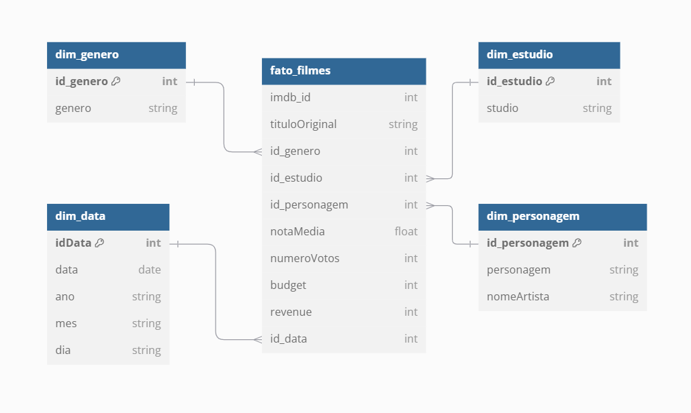
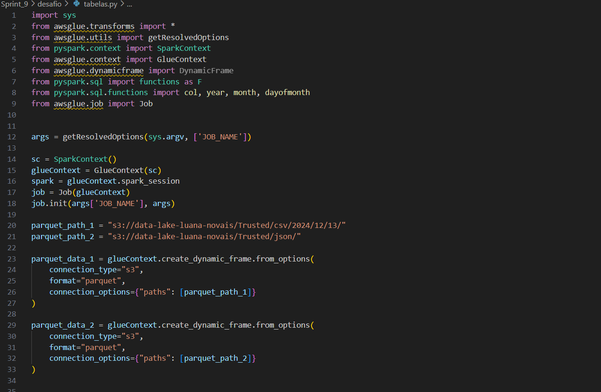
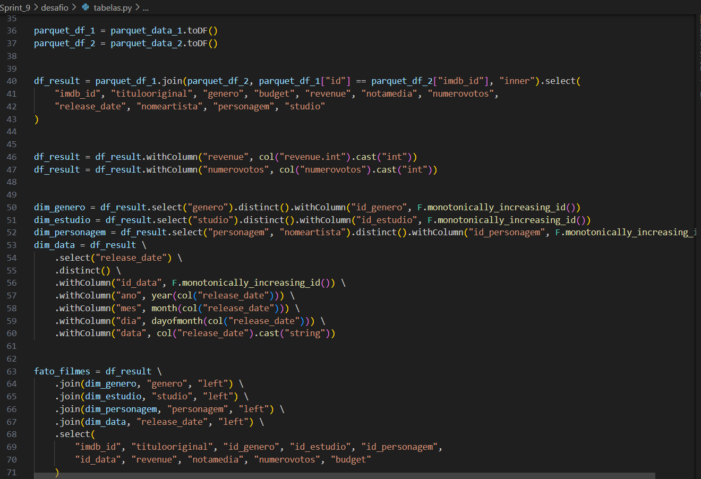
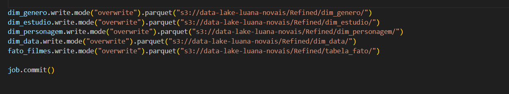
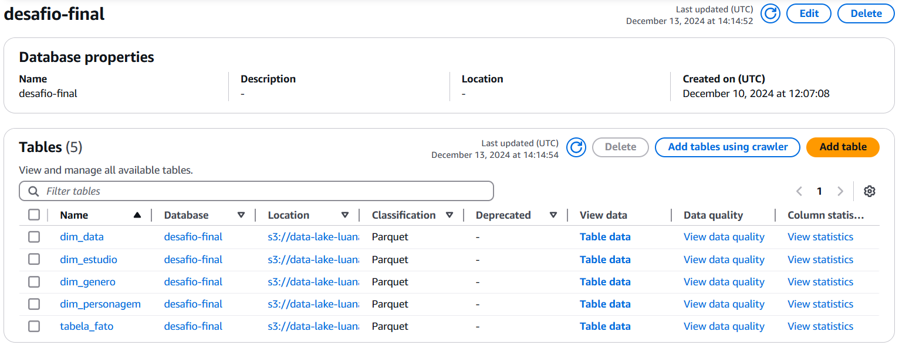
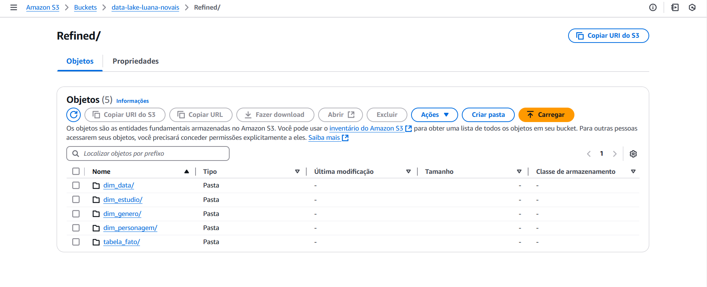

# Entrega 4

Durante esta etapa, foi necessário criar as tabelas no AWS Glue Data Catalog, com base no modelo multidimencional. Essas estruturas foram preparadas para disponibilizar os dados à ferramenta de visualização (Amazon QuickSight), que será utilizada na próxima Sprint. O processamento envolveu a utilização do Apache Spark para transformar os dados da camada Trusted e armazená-los na camada Refined, com os dados persistidos no formato Parquet, e particionados quando necessário, conforme os requisitos de visualização definidos.

Primeiramente, foi necessário entender o modelo de dados solicitado, que incluiu a aplicação de uma modelagem multidimensional. Isso significa que os dados deveriam ser organizados em tabelas de fatos e dimensões, permitindo análises detalhadas de acordo com diversas variáveis, como tempo, localização e outras métricas relevantes. A baixo segue como ficou o modelo criado para usar como base para criação das tabelas no AWS Glue: 

Com base nesse modelo, criei as tabelas necessárias no AWS Glue Data Catalog, utilizando o job, considerando as necessidades de visualização e consulta futura. A baixo o código com as explicações: 

Primeiramente, realizei as importações das bibliotecas necessárias, iniciei o Job no Glue e defini os caminhos de entrada dos arquivos da camada Trusted.

A função `glueContext.create_dynamic_frame.from_options()` é usada para ler dados no formato Parquet de duas fontes distintas (`parquet_path_1` e `parquet_path_2`), que contêm os dados de entrada na camada Trusted.

Os dados são convertidos de DynamicFrame para DataFrame do Spark (`toDF()`) para facilitar a transformação posterior.

Realizei a junção dos dados dos dois DataFrames com base em uma chave comum (`id` de um e `imdb_id` do outro), utilizando um **join interno** para combinar as informações necessárias para as análises, como título do filme, gênero, orçamento, receita, nota média e número de votos.

Além disso, apliquei conversões de tipo de dados para as colunas `revenue` e `numerovotos`, alterando-as para o tipo **inteiro**.

A partir do `df_result`, extraímos as tabelas de dimensões, como `dim_genero`, `dim_estudio`, `dim_personagem` e `dim_data`. Essas dimensões representam categorias ou atributos que serão usados nas consultas multidimensionais.

Cada tabela de dimensão foi criada com um identificador único (`id_genero`, `id_estudio`, etc.) gerado por `monotonically_increasing_id()`.

A tabela de fato, **fato_filmes**, foi criada ao unir as dimensões `dim_genero`, `dim_estudio`, `dim_personagem` e `dim_data` com o `df_result` original, formando uma tabela centralizada que contém informações quantitativas, como receita, orçamento e número de votos, relacionadas às chaves das dimensões.

As tabelas de dimensões e a tabela de fato foram gravadas na camada **Refined** do data lake em formato **Parquet**, utilizando o comando `.write.mode("overwrite")`.

Após a criação e organização das tabelas no Glue Data Catalog, foi realizado o processamento dos dados. Utilizando o Apache Spark, transformei os dados da camada **Trusted** para a camada **Refined**, de acordo com o modelo de dados especificado. Durante esse processo, os dados foram persistidos no formato Parquet, garantindo maior eficiência em termos de armazenamento e desempenho nas consultas.

Com essas transformações e a estruturação dos dados, a camada **Refined** ficou preparada para receber e organizar as informações de forma eficiente, facilitando a extração de insights. Além disso, os dados agora estão prontos para serem consumidos no **Amazon QuickSight** na próxima etapa.

Após realizar o Job com sucesso, as tabelas foram criadas no AWS Glue Catalog e a camada Refined foi criada, como podemos ver nas imagens: 

